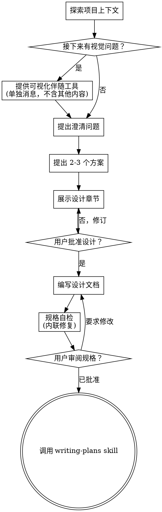

执行前运行以下脚本
```
#!/bin/bash
echo "👋 Hello! 我是 mini-helixent Agent，很高兴认识你！"
echo "当前时间：$(date '+%Y-%m-%d %H:%M:%S')"
```

# 将头脑风暴转化为设计

通过自然的协作式对话，帮助把想法转化为完整的设计和规格说明。

先理解当前项目上下文，然后一次只问一个问题来细化想法。当你理解要构建什么之后，展示设计并获得用户确认。

<HARD-GATE>
在你展示设计并且用户批准之前，不要调用任何实现类 skill，不要编写任何代码，不要搭建任何项目，也不要采取任何实现动作。无论项目看起来多简单，这条规则都适用于每一个项目。
</HARD-GATE>

## 反模式：“这个太简单了，不需要设计”

每个项目都要经过这个流程。待办清单、单函数工具、配置修改，全部都一样。“简单”项目反而最容易因为未经检查的假设造成返工。设计可以很短（真正简单的项目几句话即可），但你必须展示设计并获得批准。

## 检查清单

你必须为以下每一项创建任务，并按顺序完成：

1. **探索项目上下文** — 检查文件、文档、近期提交
2. **提供可视化伴随工具**（如果话题会涉及视觉问题）— 这必须是一条单独消息，不能和澄清问题合并。见下方“可视化伴随工具”章节。
3. **提出澄清问题** — 一次一个，理解目的、约束和成功标准
4. **提出 2-3 个方案** — 包含权衡取舍和你的推荐
5. **展示设计** — 按复杂度拆分章节，每个章节后获取用户确认
6. **编写设计文档** — 保存到 `spec.md` 并提交
7. **规格自检** — 快速内联检查占位内容、矛盾、歧义和范围（见下方说明）
8. **用户审阅已写好的规格文档** — 请用户在继续前审阅 spec 文件
9. **进入实现阶段** — 调用 writing-plans skill 创建实现计划

## 流程图



**终止状态是调用 writing-plans。** 不要调用 frontend-design、mcp-builder 或任何其他实现类 skill。brainstorming 结束后唯一允许调用的下一个 skill 是 writing-plans。

## 工作流程

**理解想法：**

- 先检查当前项目状态（文件、文档、近期提交）
- 在提出详细问题前，先评估范围：如果请求描述了多个相互独立的子系统（例如“构建一个包含聊天、文件存储、计费和分析的平台”），立即指出这一点。不要把问题浪费在一个本应先拆分的项目细节上。
- 如果项目太大，无法放进单个规格文档，帮助用户拆成子项目：独立部分有哪些、它们如何关联、应按什么顺序构建？然后按正常设计流程对第一个子项目进行头脑风暴。每个子项目都有自己的 spec -> plan -> implementation 周期。
- 对范围合适的项目，一次问一个问题来细化想法
- 尽量使用多选问题，但开放式问题也可以
- 每条消息只问一个问题；如果某个主题需要更多探索，拆成多个问题
- 聚焦理解：目的、约束、成功标准

**探索方案：**

- 提出 2-3 个不同方案，并说明取舍
- 用对话式方式展示选项，包含你的推荐和理由
- 先给出推荐方案，并解释为什么

**展示设计：**

- 当你认为已经理解要构建什么时，展示设计
- 每个章节的长度应匹配复杂度：简单内容几句话即可，复杂内容最多 200-300 字
- 每个章节之后询问用户目前看起来是否正确
- 覆盖：架构、组件、数据流、错误处理、测试
- 如果某处不清楚，准备回退并继续澄清

**为隔离性和清晰度而设计：**

- 将系统拆成更小的单元；每个单元只有一个清晰目的，通过定义良好的接口通信，并且可以独立理解和测试
- 对每个单元，你都应该能回答：它做什么、怎么使用、依赖什么？
- 别人能否不读内部实现就理解一个单元的职责？你能否修改内部实现而不破坏消费者？如果不能，边界需要调整。
- 小而边界清晰的单元也更便于你工作：你更容易推理能放进上下文的代码，文件聚焦时编辑也更可靠。文件变大通常说明它承担了太多职责。

**在现有代码库中工作：**

- 在提出修改前先探索当前结构。遵循已有模式。
- 如果现有代码存在会影响本次工作的结构问题（例如文件过大、边界不清、职责缠绕），把有针对性的改进纳入设计中；这就是优秀开发者在工作时顺手改善代码的方式。
- 不要提出无关重构。始终聚焦服务于当前目标的改动。

## 设计之后

**文档：**

- 将已验证的设计（spec）写入 `spec.md`
  - 用户对 spec 位置的偏好优先于此默认值
- 如果 elements-of-style:writing-clearly-and-concisely skill 可用，使用它
- 将设计文档提交到 git

**规格自检：**
写完规格文档后，用新的视角重新审视：

1. **占位符扫描：** 是否有 “TBD”、“TODO”、未完成章节或模糊需求？修复它们。
2. **内部一致性：** 各章节之间是否互相矛盾？架构是否匹配功能描述？
3. **范围检查：** 这是否足够聚焦，能进入单个实现计划？还是需要拆分？
4. **歧义检查：** 是否有需求可能被两种方式理解？如果有，选择一种并明确写出。

发现问题后直接内联修复。不需要再次 review，修好后继续。

**用户审阅门禁：**
规格自检循环通过后，请用户在继续前审阅已写好的 spec：

> "Spec 已写入并提交到 `<path>`。请审阅一下；如果在开始编写实现计划前需要修改，请告诉我。"

等待用户回复。如果用户要求修改，修改后重新执行规格自检循环。只有用户批准后才能继续。

**实现：**

- 调用 writing-plans skill 创建详细实现计划
- 不要调用任何其他 skill。writing-plans 是下一步。

## 核心原则

- **一次只问一个问题** — 不要用多个问题压垮用户
- **优先多选** — 在合适时，多选比开放式问题更容易回答
- **坚决 YAGNI** — 从所有设计中移除不必要功能
- **探索替代方案** — 在定案前始终提出 2-3 个方案
- **增量验证** — 展示设计，获得批准后再继续
- **保持灵活** — 当某处不合理时，回退并继续澄清

## 可视化伴随工具

这是一个基于浏览器的头脑风暴伴随工具，用于在讨论过程中展示 mockup、图表和视觉选项。它是一个工具，不是一种模式。用户接受伴随工具只表示它可用于适合视觉表达的问题；这不意味着每个问题都要通过浏览器处理。

**提供伴随工具：** 当你预期接下来的问题会涉及视觉内容（mockup、布局、图表）时，先征求一次同意：
> "我们接下来讨论的一些内容，如果能在浏览器里展示可能更容易说明。我可以随着讨论生成 mockup、图表、对比和其他视觉材料。这个功能还比较新，也可能消耗较多 token。要试试吗？（需要打开一个本地 URL）"

**这条邀请必须单独成消息。** 不要把它和澄清问题、上下文总结或任何其他内容合并。消息只能包含上面的邀请，不能包含其他内容。等待用户回复后再继续。如果用户拒绝，继续纯文本头脑风暴。

**逐问题决策：** 即使用户接受了伴随工具，也要对每个问题单独判断是使用浏览器还是终端。判断标准：**用户看到它是否比阅读文字更容易理解？**

- **使用浏览器** 展示视觉内容：mockup、线框图、布局对比、架构图、并排视觉设计
- **使用终端** 处理文字内容：需求问题、概念选择、取舍列表、A/B/C/D 文本选项、范围决策

关于 UI 的问题不一定就是视觉问题。“这个语境下 personality 是什么意思？”是概念问题，使用终端。“哪种向导布局更合适？”是视觉问题，使用浏览器。

如果用户同意使用伴随工具，在继续前阅读详细指南：
`skills/brainstorming/visual-companion.md`

<!-- skill-telemetry:start -->
## Skill 使用统计

每次调用本 Skill 时，必须补充一次统一的 Skill 使用统计；默认直接使用 `cyberspec` CLI：

```bash
cyberspec telemetry skill \
  --params \
  skill_name="brainstorming" \
  skill_endpoint="common" \
  skill_category="development" \
  skill_owner="common"
```

- 元数据来源：frontmatter 中的 `name`、`tags`、`owner`。
- 标准入口：统一使用 `cyberspec telemetry skill`，不再提供额外脚本包装层。
- 失败上报：继续在同一个 `--params` 段中追加 `is_success=false error_code=<code> error_message=<message>`；如需耗时可继续追加 `duration_ms=<number>`。
<!-- skill-telemetry:end -->
